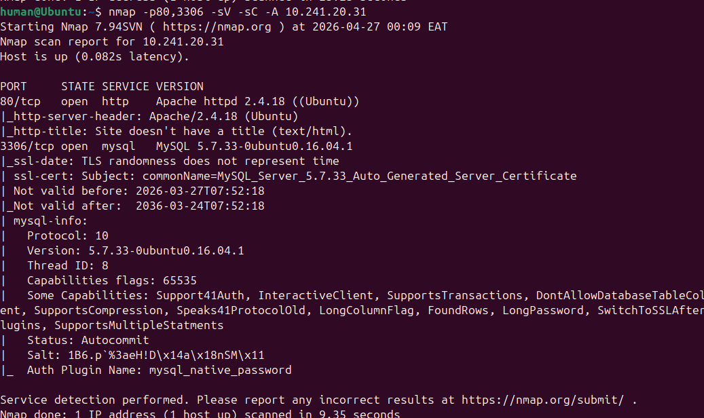
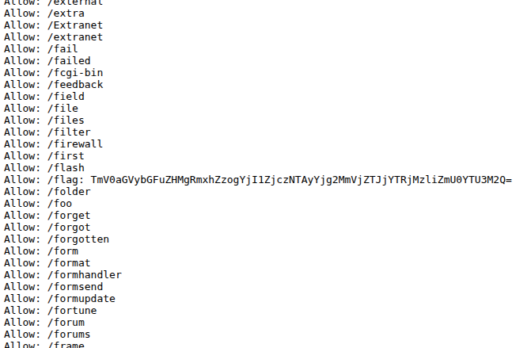
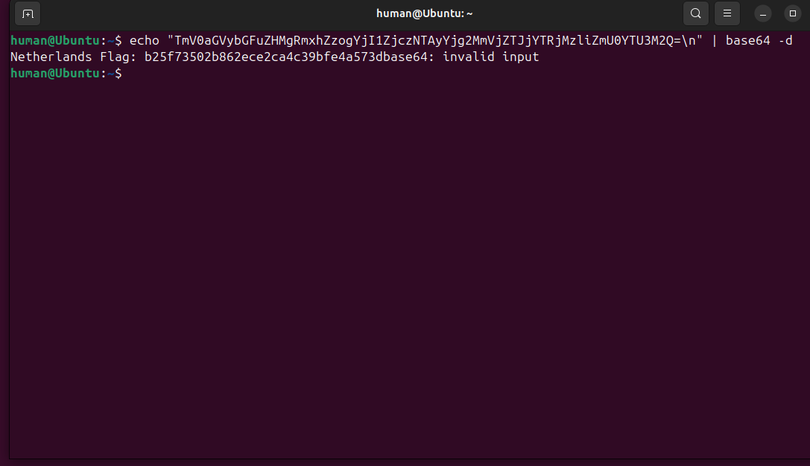
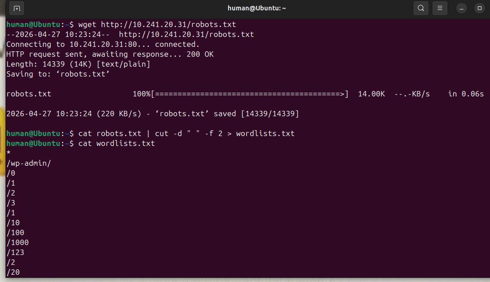
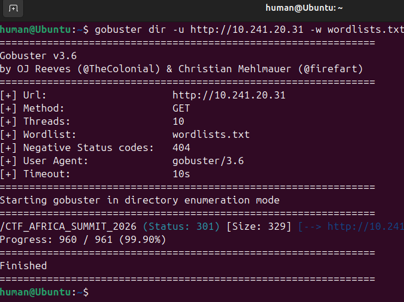
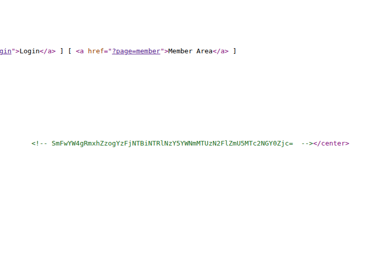
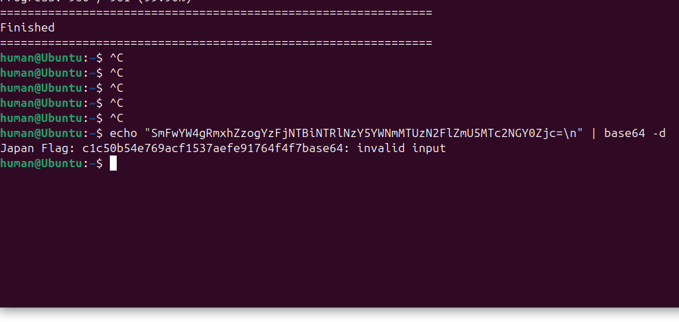
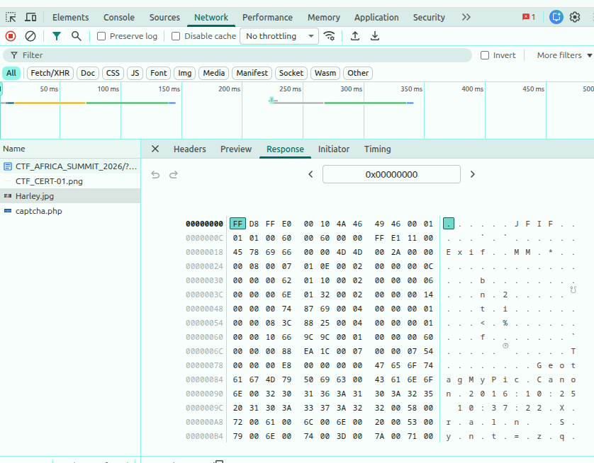
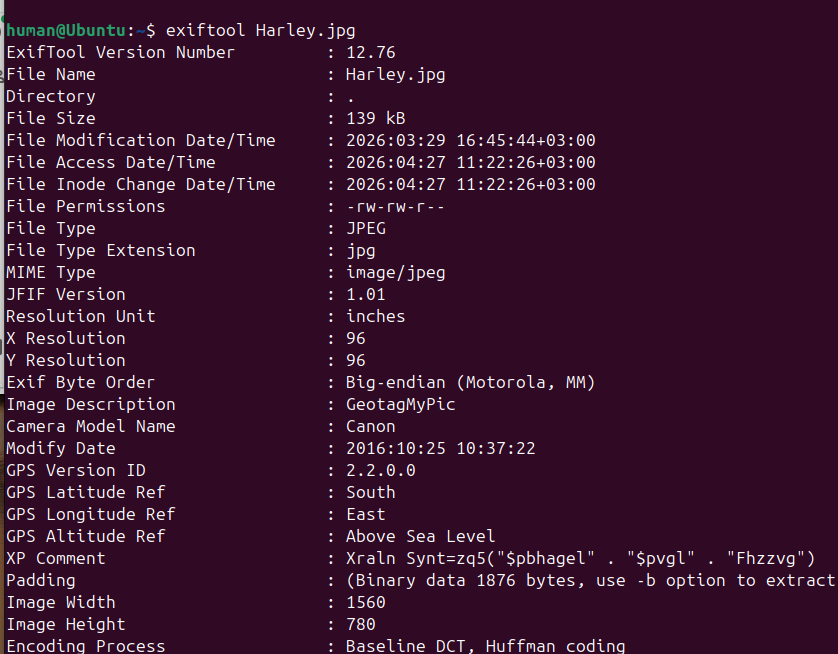
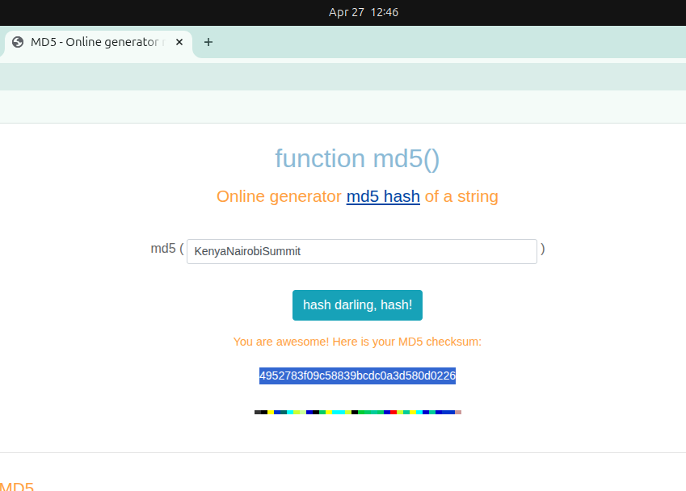

## FIRST FLAG

### Reconnaisance

- We started with mapping the network with nmap to identify the running services in the target IP, we first run a port identification scan `nmap -p- 10.241.20.31` which gave me two ports `http, 80` and `mysql, 3306`, I then used the ports to dig dip using the command `nmap -p80, 3306 10.241.20.31` with flag `-sC` for to run default scripts and `-sV` to detect service version

### Assets Discovery
- We started by enumerating port `80, http`, we visited the site but there was nothing of interest in the default page, the next step was to use dirb to get other subdirectories in the page, the attempt was unsuccesfull as dirb kept timing out which made me change my methodology. We tried checking `robots.txt` and boom, there it was, indexed subdirectories and among them a flag that required decoding from what seemed to be base64 first

- Decoding it from base64 gave the flag 

> FLAG `Netherlands Flag: b25f73502b862ece2ca4c39bfe4a573dbase64`

## SECOND FLAG
### Directory Discovery
- We used the indexed words in the robots.txt to curate a wordlist and use it subdirectory bursting, we used gobuster to do a directory bursting or bruteforce, if you like it that way.

- We found this subdirectory `/CTF_AFRICA_SUMMIT_2026`. Visiting the site we found a website, we tried checking the source code for any front-end bugs and we found a base64 string commenent on the home page which we decoded and got a flag

> FLAG `Japan Flag: c1c50b54e769acf1537aefe91764f4f7`

## FIFTH FLAG
### Steganography
- While inspecting the different pages, We came across the flag page, we tried inpecting the files through the Sources tab to understand how the random code is generated, on the process we realised that the Harley.png file had some interesting strings inside, so we downloded it using wget and tried running strings on it, we went further and inspected it using exitool, we noticed an interesting string which seemed encoded. we quickly figured out that it was rot13 and using cyberchef we decoded it. 

- We googled for md5 generators and tried to combine the words into this hash, we submitted the hash in flag format

> FLAG `Kenya Flag: 4952783f09c58839bcdc0a3d580d0226`

