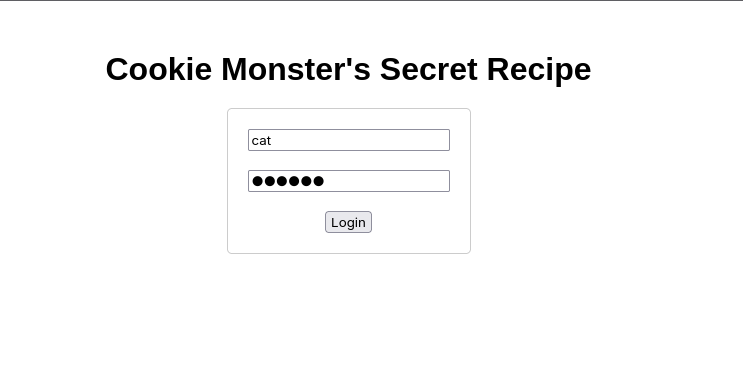
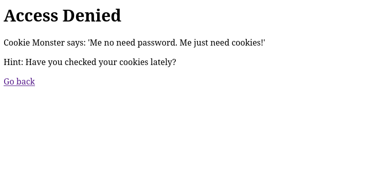
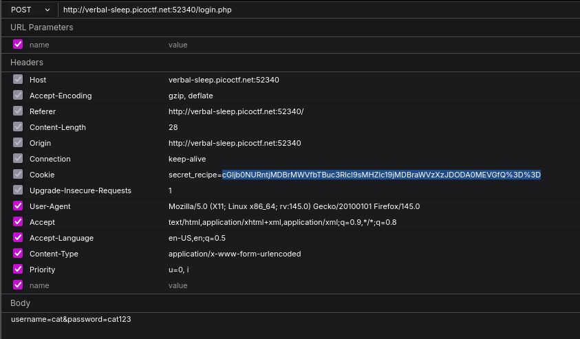
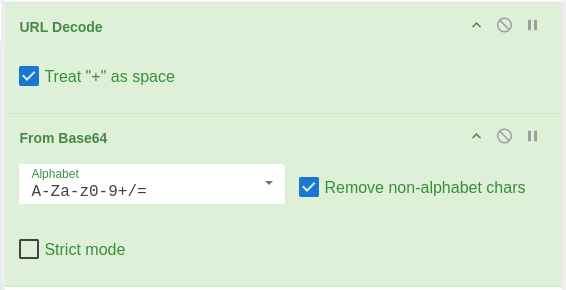

# [Cookie Monster Secret Recipe](https://play.picoctf.org/practice/challenge/469?category=1&page=1)

## Description
>Cookie Monster has hidden his top-secret cookie recipe somewhere on his website. As an aspiring cookie detective, your mission is to uncover this delectable secret. Can you outsmart Cookie Monster and find the hidden recipe?

>Additional details will be available after launching your challenge instance.

## Solution
- When we follow the challenge link, we land on a login page, we can enter any credentials, i.e username=*foo*&password=*bar* or username=*cat*&password=*cat123* like below. 
- The challenge was direct and it just required us to inspect the cookie and decode the flag

	cGljb0NURntjMDBrMWVfbTBuc3Rlcl9sMHZlc19jMDBraWVzXzJDODA0MEVGfQ%3D%3D

>`FLAG: picoCTF{c00k1e_m0nster_l0ves_c00kies_2C8040EF}`

**NB:** *This challenge seems very basics but it actually carries a very deep concept. It aims to help us understand how the server generates cookie tokens and the transaction with the user*

## Scripts
#### Python
	python3 cookie-monster-secret-recipe.py <port>

[DOWNLOAD/VIEW SRIPT](cookie-monster-secret-recipe.py)
#### Curl
 
## Resources

