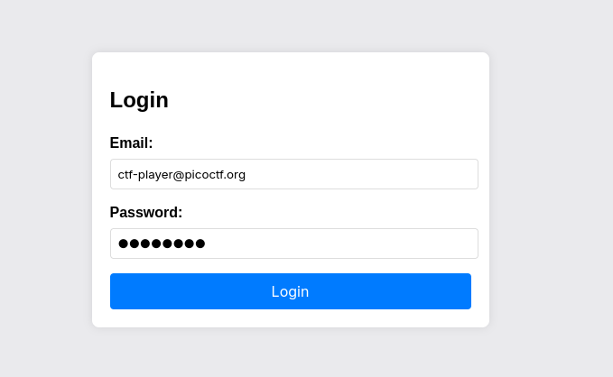
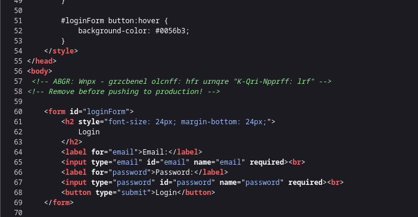
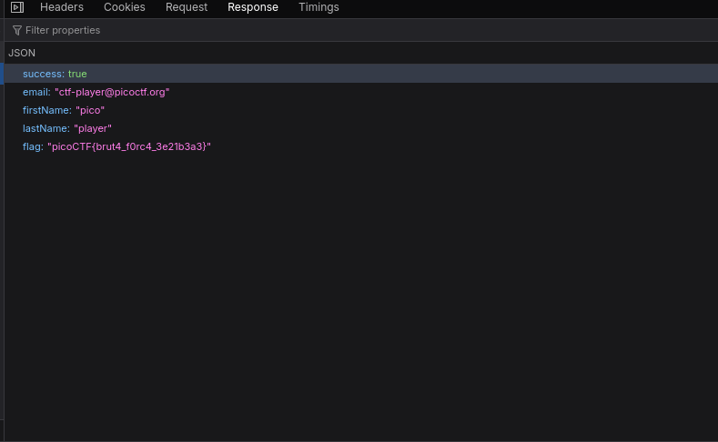

# [CRACK THE GATE 1](https://play.picoctf.org/practice/challenge/520?category=1&page=1)
## Description
>We’re in the middle of an investigation. One of our persons of interest, ctf player, is believed to be hiding sensitive data inside a restricted web portal. We’ve uncovered the email address he uses to log in: ctf-player@picoctf.org. Unfortunately, we don’t know the password, and the usual guessing techniques haven’t worked. But something feels off... it’s almost like the developer left a secret way in. Can you figure it out?

>Additional details will be available after launching your challenge instance.  

## Solution  
* There are alot of ways to approach this challenge. Lets explore ones which does not involve burpsuite to avoid inconviniencing those who dont have the tool.
* Once we open the site you are met with a login form. we know the email from the description above but not the password.

  

* On inspecting the page, we see a comment that looks ROT13 incrypted,

  

Lets decrypt the string using ROT13 option in [CyberChef](https://cyberchef.io) or we can write a small bash script to do so for us

	echo "ABGR: Wnpx - grzcbenel olcnff: hfr urnqre \"K-Qri-Npprff: lrf\"" | tr 'A-Za-z' 'N-ZA-Mn-za-m'

we get this 

`NOTE: Jack - temporary bypass: use header "X-Dev-Access: yes`"    
- From this we know that we have to add/use the header X-Dev-Access and set its value to yes in order to bypass the middleware. 
- We can do that through the network Tab in the inspect(Q), (Prefarably firefox). 
- We submit the login details form, using the email we already knew and a decoy password and then head over to the **network tab**, left click the **Login request**, select **edit and resend**. we add the header at the bottom of the headers and click **send**. 
- We notice that when we check the response we can see that we actually got a 200 status code meaning that it was succesfully, and the flag is also shown in the response, in the Network tab. NOTE: The results might not necessarily display on the browser

  

> FLAG: picoCTF{DECOY}

## Scripts
#### Python
	python3 crack-the-gate1.py <port>

[DOWNLOAD/VIEW SRIPT](crack-the-gate1.py)
#### Curl
 
## Resources

