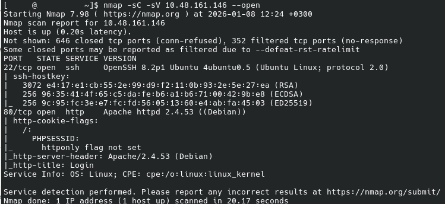
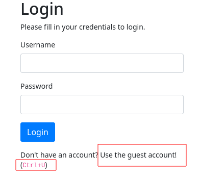
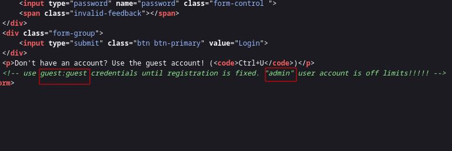
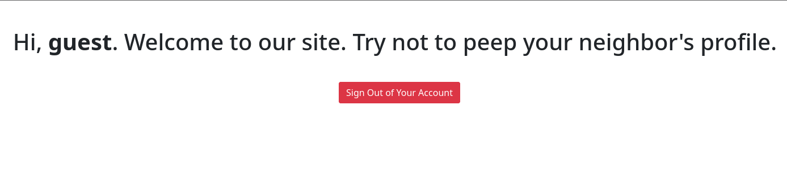
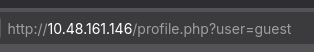

# NEIGHBOUR
## CHALLENGE
Check out our new cloud service, Authentication Anywhere -- log in from anywhere you would like! Users can enter their username and password, for a totally secure login process! You definitely wouldn't be able to find any secrets that other people have in their profile, right?

HINT: [IDOR](https://tryhackme.com/room/idor)

## SOLUTION
**ENUMERATION**

* The first step of Enumeration was to run nmap to check for open ports. we find two ports open, port 22 and 80, lets started with the easier port to exploit, port 80 (http)
 
```
nmap -sC -sV --open 10.48.161.146
```



**EXPLOITATION**

* When you access port 80, you are met with a login sign, below it there is a sign that directs you to check at the source code for an alternative login.(CTRL + U)  



* At the source code we are directed to login with guest logins *guest:guest*
* There is also a hint of the existance of the `admin` user



* On login we are met with the guest page, we notice the URL append the username to the user parameter, there are alot of vulnurabilities we can test here, but lets start with the obvious ones  




* Since we already know of the existance of the user admin, lets try and see if we can access the user by changing the value from `guest`to `admin`.


* And yes it works succesfully and we have the flag.

